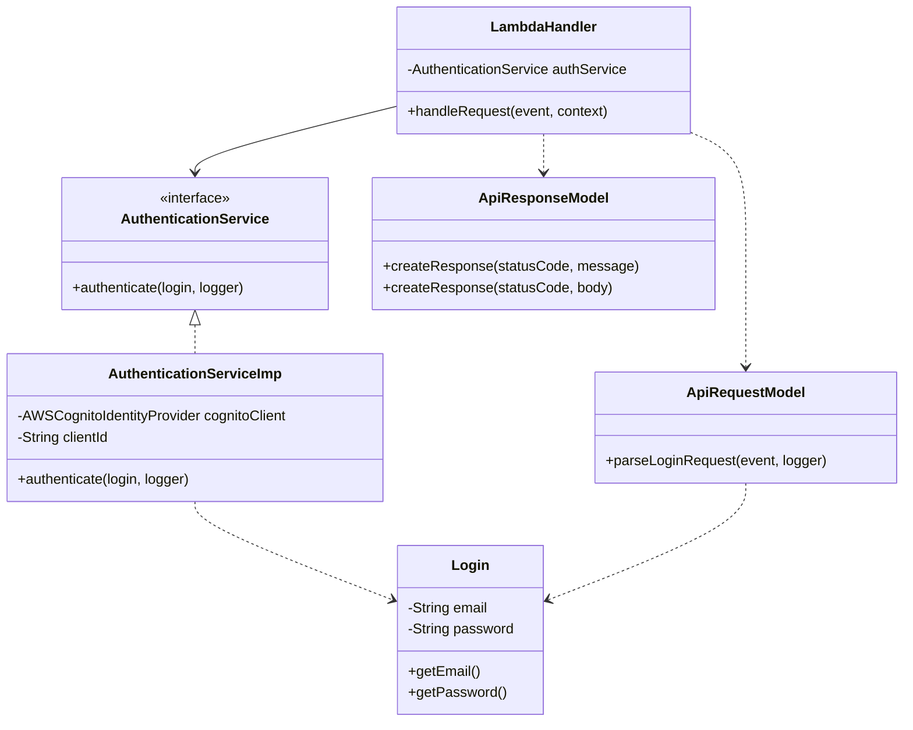

# AWS Lambda com Autenticação Cognito 🚀

[](https://sonarcloud.io/summary/new_code?id=fiap-8soat-tc-one_hackathon-fiap-cognito-auth)
[](https://github.com/fiap-8soat-tc-one/hackathon-fiap-cognito-auth/actions/workflows/build.yml)

## 📘 Visão Geral
Este repositório contém uma função AWS Lambda desenvolvida em Java 21, que implementa autenticação de usuários utilizando Amazon Cognito. O projeto é empacotado com Docker e implantado através do AWS SAM (Serverless Application Model).

## 🔨 Tecnologias Utilizadas

- **Java 21**: Linguagem principal
- **Maven**: Gerenciamento de dependências e build
- **AWS Lambda**: Computação serverless
- **Amazon Cognito**: Serviço de autenticação
- **Docker**: Containerização
- **AWS SAM**: Framework serverless
- **GitHub Actions**: CI/CD
- **SonarCloud**: Análise de qualidade de código

## 📦 Estrutura do Projeto

```
hackathon-fiap-cognito-auth/
├── .github/workflows/           # Pipeline de CI/CD
├── HackathonFiapCognitoAuth/   # Código fonte principal
│   ├── src/
│   │   ├── main/java/cogniteAuth/
│   │   │   ├── domain/         # Classes de domínio
│   │   │   ├── infrastructure/ # Implementações de serviços
│   │   │   ├── models/        # Classes de modelo
│   │   │   └── services/      # Interfaces de serviço
│   ├── Dockerfile             # Configuração do container
│   └── pom.xml               # Configuração Maven
├── template.yaml             # Template SAM
└── setup.sh                 # Script de setup do ECR
```

## 🏗️ Arquitetura do Projeto

### Diagrama de Classes


### 🔄 Fluxo da Aplicação

1. **Requisição HTTP (POST)**
   - Cliente envia requisição para API Gateway
   - Payload: `{"email": "user@example.com", "password": "senha"}`

2. **Processamento Lambda**
   ```mermaid
   sequenceDiagram
       Client->>API Gateway: POST /auth
       API Gateway->>Lambda: Invoke
       Lambda->>Cognito: InitiateAuth
       Cognito-->>Lambda: AuthResult
       Lambda-->>API Gateway: Response
       API Gateway-->>Client: JWT Tokens
   ```

3. **Resposta**
   ```json
   {
     "id_token": "eyJhbG...",
     "expires_in": "3600"
   }
   ```

## ⚙️ Configurações

### Variáveis de Ambiente
- `COGNITO_CLIENT_ID`: ID do cliente Cognito (Obrigatório)

### Recursos AWS SAM
```yaml
Resources:
  Function:
    Type: AWS::Serverless::Function
    Properties:
      Runtime: java21
      Handler: cogniteAuth.LambdaHandler
      MemorySize: 128
      Timeout: 300
```

## 🚀 Como Executar

### Pré-requisitos
- JDK 21
- Maven
- Docker
- AWS CLI configurado
- AWS SAM CLI

### Build Local
```bash
# Build do projeto
mvn clean package

# Build da imagem Docker
docker build -t auth-lambda .

# Executar localmente
sam local start-api
```

### Deploy
```bash
# Build SAM
sam build

# Deploy na AWS
sam deploy --guided
```

## 🔍 Monitoramento e Logs

A aplicação utiliza CloudWatch para logging e monitoramento. Os logs incluem:
- Tentativas de autenticação
- Erros de autenticação
- Métricas de performance

## 🛡️ Segurança

- Autenticação via Amazon Cognito
- Tokens JWT com expiração configurável
- HTTPS/TLS para todas as comunicações
- Secrets gerenciados via AWS Secrets Manager

## 📊 Qualidade de Código

O projeto utiliza SonarCloud para garantir:
- Cobertura de testes
- Análise estática de código
- Detecção de vulnerabilidades
- Métricas de qualidade

## 🤝 Contribuindo

1. Fork o projeto
2. Crie uma branch (`git checkout -b feature/nova-feature`)
3. Commit suas mudanças (`git commit -am 'Adiciona nova feature'`)
4. Push para a branch (`git push origin feature/nova-feature`)
5. Abra um Pull Request

## ✉️ Suporte

Para dúvidas ou sugestões, entre em contato com o time técnico responsável pelo Hackaton FIAP.

